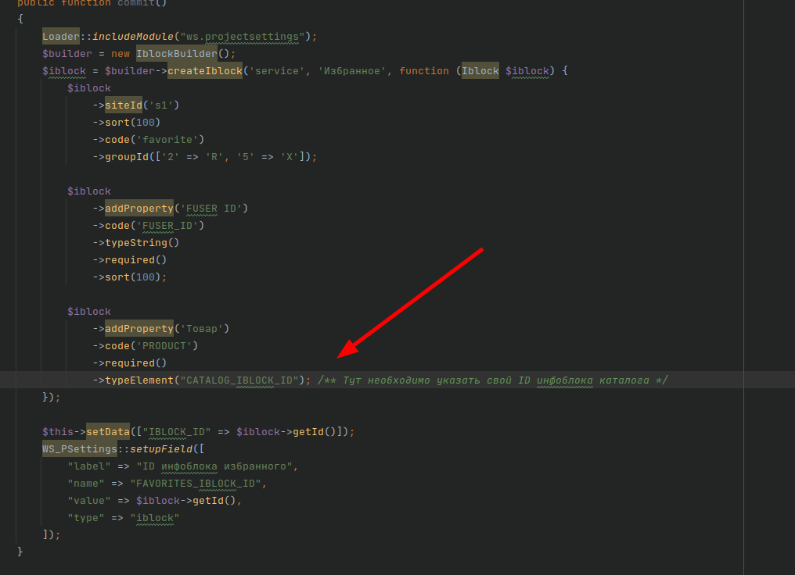
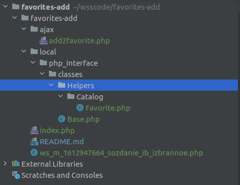
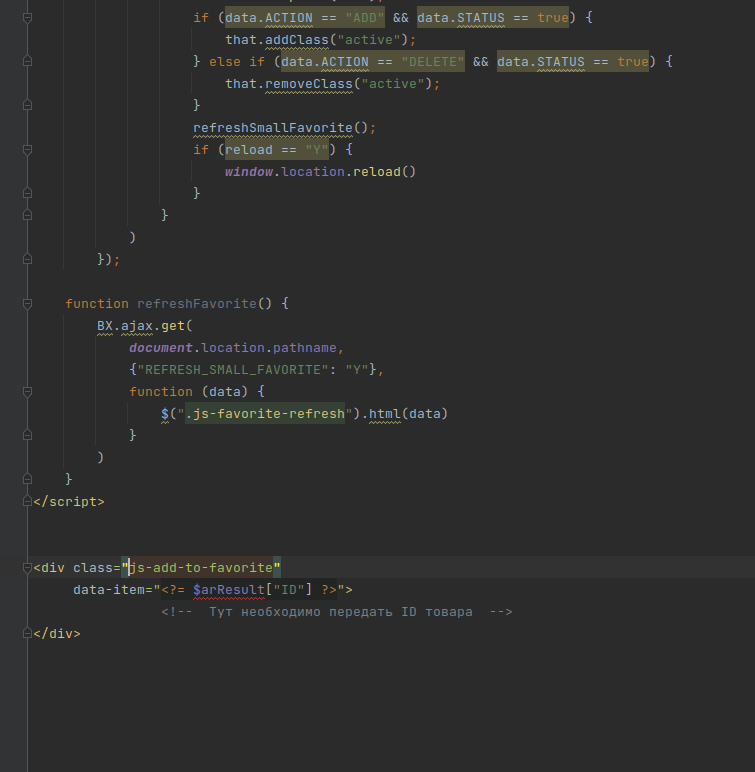

# Избранное

Данное решение предназначено для быстрой реализации функционала Избранного (добавление, хранение)
с использованием FUSER_ID

## Принцип работы

Данное решение создает инфоблок, в котором хранится информация о товарах, добавленных в избранное.
Также предусмотрен функционал добавления товара в Избранное.

## Создание инфраструктуры

В корне репозитория лежит миграция по созданию всех необходимых настроек проекта (ID инфоблока,),
а также по созданию самого инфоблока "Избранное".

**!!! Важно !!! Не забудьте заменить ID инфоблока каталога на свой**

## Размещение файлов

Также необходимо разместить классы _**/local/php_interface/classes/Helpers/Base.php**_ 
(если отсутствует) и _**/local/php_interface/classes/Helpers/Catalog/Favorite.php**_

Эти классы нужны для работы функционала добавления и хранения записей о товарах в Избранном.

Еще нужно разместить файл **_add2favorite.php_** в папке _**/ajax/**_ (создать ее, если нет). 
Данный файл будет отвечать за добавление товара в список Избранного.

## Пример интеграции

Для примера, в файле index.php размещен пример кнопки добавления в Избранное. При интеграции данного
решения в проект можно взять данную конструкцию как основу.

## Заключение

Данное решение позволяет за короткий срок реализовать на проекте функционал добавления товаров в Избранное и хранения информации об этих товарах.
